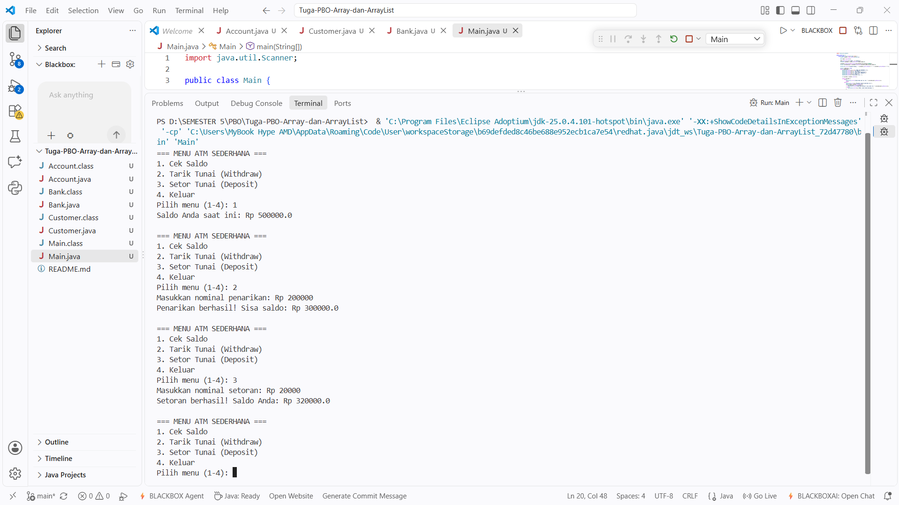

# Tugas PBO - Simulasi ATM Sederhana (Array & Array of Objects)

**Oleh:** Sri Zul'aini Ulya (F1D02410096)  
**Program Studi:** Teknik Informatika, Universitas Mataram  

## Deskripsi Proyek
Proyek ini adalah simulasi sistem perbankan dan ATM sederhana berbasis *Command Line Interface* (CLI) menggunakan bahasa Java. Tujuan utama dari tugas ini adalah menerapkan konsep **Array of Objects** dalam Pemrograman Berorientasi Objek (PBO), di mana sebuah objek dapat menyimpan kumpulan objek lain menggunakan struktur data *array*.

## Struktur Kelas
Program ini terdiri dari empat kelas utama yang saling berelasi:
1. **`Account`**: Kelas yang mengelola data rekening. Memiliki atribut `balance` (saldo) dan metode untuk `deposit` (setor) serta `withdraw` (tarik tunai).
2. **`Customer`**: Kelas yang menyimpan data nasabah (`firstName`, `lastName`). Kelas ini mengimplementasikan *Array of Objects* dengan memiliki array `accounts` yang bisa menampung hingga 5 objek `Account` per nasabah.
3. **`Bank`**: Kelas pengelola utama yang memiliki array `customers` untuk menyimpan hingga 10 objek `Customer`.
4. **`Main`**: Kelas *driver* yang berisi metode `main()`. Di sini, objek `Bank`, `Customer`, dan `Account` diinisialisasi. Kelas ini juga menggunakan `java.util.Scanner` untuk menampilkan menu ATM interaktif kepada pengguna.

---

## Penjelasan Hasil Output

Berikut adalah hasil eksekusi program `Main.java` di terminal VS Code:

### Alur Eksekusi:
Pada awal program berjalan, sistem telah membuat data nasabah dan menginisialisasi saldo awal pada akun nasabah sebesar **Rp 500.000,0**. Selanjutnya, pengguna berinteraksi dengan menu ATM sebagai berikut:

1. **Cek Saldo (Opsi 1):**
   * Pengguna menginputkan pilihan menu `1`.
   * Sistem memanggil metode `getBalance()` pada objek `Account` yang aktif.
   * **Output:** Layar menampilkan `Saldo Anda saat ini: Rp 500000.0`.

2. **Tarik Tunai / Withdraw (Opsi 2):**
   * Pengguna memilih menu `2`.
   * Sistem meminta nominal penarikan, dan pengguna memasukkan `200000`.
   * Sistem memanggil metode `withdraw(200000)`. Karena saldo (Rp 500.000) mencukupi, operasi mengembalikan nilai `true` dan saldo dikurangi.
   * **Output:** Layar menampilkan pesan `Penarikan berhasil! Sisa saldo: Rp 300000.0`.

3. **Setor Tunai / Deposit (Opsi 3):**
   * Pengguna memilih menu `3`.
   * Sistem meminta nominal setoran, dan pengguna memasukkan `20000`.
   * Sistem memanggil metode `deposit(20000)`. Saldo yang sebelumnya bernilai Rp 300.000 kini bertambah menjadi Rp 320.000.
   * **Output:** Layar menampilkan pesan `Setoran berhasil! Saldo Anda: Rp 320000.0`.

## Cara Menjalankan Program
1. Pastikan Java Development Kit (JDK) sudah terinstal.
2. Buka terminal pada folder proyek (`Tuga-PBO-Array-dan-ArrayList`).
3. Compile semua file java: `javac *.java`
4. Jalankan program utama: `java Main`